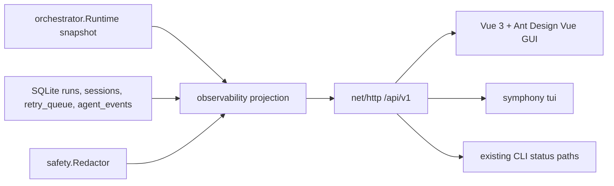
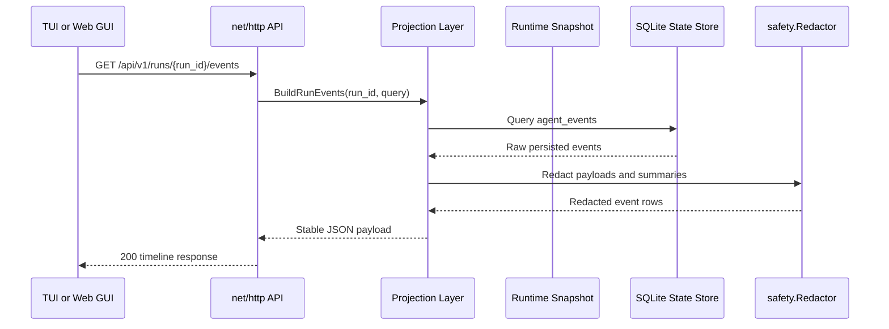

# Symphony Go Operator UI Design

Date: 2026-05-06
Status: Accepted design for planning

## Goal

Add first-class operator-facing TUI and Web GUI surfaces for `symphony-go`.
Both surfaces must read from the same stable observability contract instead of
each reconstructing runtime state independently.

The UI should make current orchestration state easy to scan and make turn
details complete enough for debugging. The Web GUI uses Vue 3, Ant Design Vue,
and Vite. The TUI should stay visually consistent with the existing Symphony
terminal dashboard style.

## Decisions

- Build one shared backend observability contract first.
- Continue using the standard library `net/http`; do not introduce Gin.
- Keep the UI read-only in this design.
- Bind the operator HTTP surface to loopback by default and do not add
  authentication for the local-only first design.
- Show historical completed runs as well as active and retrying work.
- Show full turn detail as a humanized operation timeline with expandable raw
  JSON payloads.
- Do not provide JSON download from the UI.
- Redact payloads before returning them from the API.
- Put the frontend source under `web/`.
- Let the Go server serve the production Web GUI build at `/`; use Vite's dev
  server only during frontend development.

## Non-Goals

- Public hosted dashboard.
- Multi-tenant control plane.
- Login, roles, or remote operator authentication.
- Mutating controls in TUI or Web GUI, including pause, resume, drain, cancel,
  retry, or cleanup.
- Replacing the existing CLI operator commands.
- Replacing structured logs, metrics, or Linear issue truth.

## Current Context

The Go runtime already exposes local operator endpoints in `internal/server`,
including `/status`, `/runs`, `/runs/{id}`, `/healthz`, `/readyz`, `/metrics`,
and lifecycle control endpoints. These endpoints are useful but are not yet a
stable dashboard API.

Durable local state already exists in SQLite. The `runs`, `sessions`,
`retry_queue`, and `agent_events` tables are the right basis for historical
run and event detail. Runtime snapshots are the right basis for live summary
data, but they are not enough for complete turn history.

The existing Symphony Elixir UI provides the interaction reference:

- compact terminal status dashboard
- running and backoff sections
- token, runtime, throughput, and rate-limit summaries
- compact session IDs and humanized last Codex event text
- Web dashboard backed by a JSON observability API

The Go UI should follow that operator shape while improving turn-detail
readability.

## Architecture



The key boundary is the projection layer. It owns the stable JSON shape,
humanized event summaries, redaction, pagination defaults, and compatibility
rules. HTTP handlers should stay thin: parse path/query parameters, call the
projection layer, and return JSON or a stable error envelope.

## Backend API

Use versioned routes under `/api/v1`. Existing non-versioned endpoints can
remain for compatibility.

### `GET /api/v1/state`

Returns the dashboard summary:

- generated timestamp
- lifecycle state and readiness
- counts for running, retrying, completed, failed, and stopped
- active running rows
- retry rows
- latest completed or failed rows
- aggregate token and runtime totals
- latest rate-limit payload when available

The active rows should come from the in-memory snapshot. Historical rows should
come from SQLite when a state store is configured.

### `GET /api/v1/runs`

Returns paginated run rows. Query parameters:

- `status`: optional comma-separated run statuses
- `issue`: optional issue identifier or issue id
- `limit`: bounded positive integer
- `cursor`: opaque cursor for the next page

Rows include run id, issue id, issue identifier, status, attempt, workspace
path, session id, thread id, turn id, started time, finished time, error
summary, and token totals when available.

### `GET /api/v1/runs/{run_id}`

Returns one run detail:

- run metadata
- issue identity
- workspace path
- current or final status
- session metadata
- latest event summary
- token totals
- retry or failure information

This endpoint should not inline the full event stream. The Web GUI loads events
through the events endpoint so large histories do not make the detail payload
unbounded.

### `GET /api/v1/runs/{run_id}/events`

Returns a paginated operation timeline for one run. Query parameters:

- `limit`: bounded positive integer
- `cursor`: opaque cursor
- `category`: optional category filter

Each event includes:

- `sequence`
- `id`
- `at`
- `category`
- `severity`
- `title`
- `summary`
- `issue_id`
- `issue_identifier`
- `run_id`
- `session_id`
- `thread_id`
- `turn_id`
- `payload`

The `payload` field is the full redacted JSON payload for that event. It is
expandable in the UI but not offered as a file download.

### `GET /api/v1/issues/{identifier}/latest`

Returns the latest known run for an issue identifier. This gives TUI and humans
a convenient stable lookup path for commands like `symphony tui --run TOO-141`.

### Error Envelope

All API errors use:

```json
{
  "error": {
    "code": "run_not_found",
    "message": "Run not found"
  }
}
```

Methods that are not allowed should return `405`. Missing resources should
return `404`. Invalid query parameters should return `400`.

## Event Projection

The raw Codex app-server stream is too low-level for the primary UI. The
projection layer should map raw events into humanized operation timeline rows.

Categories:

- `lifecycle`: session and turn start, completion, failure, cancellation, input
  required
- `message`: agent/user messages and reasoning summaries
- `command`: command begin, output, and end
- `tool`: dynamic tool and MCP tool call begin, end, and failure
- `diff`: patch or diff updates
- `resource`: token usage, rate-limit updates, timeout and stall signals
- `guardrail`: approval auto-handling, sandbox or resource-boundary stops
- `error`: malformed events, process failures, retry reasons, non-retryable
  failures

The projection should keep raw payloads available through `payload`, but the
visible timeline label should always be readable without opening JSON.

## Redaction

All API payloads that originate from Codex events, command output, tool calls,
tracker responses, env-derived config, or local paths must pass through
`safety.Redactor` before being returned.

Redaction applies to:

- raw JSON payloads
- timeline summaries
- command output excerpts
- tool call arguments and responses
- error strings
- workspace or credential-bearing paths

The UI must never receive unredacted payloads and then redact client-side.
Client-side redaction may exist only as an additional display safeguard.

## TUI Design

The TUI is read-only and should match the existing Symphony terminal style.

Primary command:

```bash
symphony tui
```

Default view:

- title: `SYMPHONY STATUS`
- agents count
- runtime
- token totals
- latest rate limits
- running table
- retry/backoff table
- latest completed/failed summary when space allows

The running table should keep compact columns:

- issue identifier
- stage/status
- age and turn count
- tokens
- compact session id
- humanized latest event

Detail command:

```bash
symphony tui --run TOO-141
symphony tui --run-id run_...
```

The detail view displays the timeline for one run. It may page through events
and should favor readable summaries first, with raw payload shown only when
explicitly requested by a command-line flag or detail mode.

The first implementation can use ANSI rendering with standard library terminal
handling. A richer TUI library such as Bubble Tea should be considered only if
keyboard navigation, folding, search, or live panes become required.

## Web GUI Design

Technology:

- Vue 3
- Ant Design Vue
- Vite
- TypeScript

Repository layout:

```text
web/
  package.json
  vite.config.ts
  src/
    api/
    components/
    pages/
    stores/
```

Production behavior:

- Vite builds static assets.
- Go embeds or serves the built assets at `/`.
- The Web GUI consumes `/api/v1/*`.

Development behavior:

- Vite dev server serves the frontend.
- Vite proxies `/api/v1` to the local Go operator endpoint.

Page structure:

- top status bar with lifecycle, readiness, runtime, token totals, and rate
  limits
- left run list with filters for running, retrying, completed, failed, and
  stopped
- main run detail page
- operation timeline as the primary detail view
- right-side detail pane for the selected timeline event

The complete turn view should be a detail page or split pane, not a modal.
Modals may be used only for quick peek interactions, such as viewing the latest
event from a dashboard row.

## Data Flow



The Web GUI and TUI should not query SQLite directly. They should not parse raw
agent events independently.

## Testing

Backend tests:

- `httptest` coverage for every `/api/v1` endpoint
- status code and error envelope tests
- query validation tests
- pagination tests
- redaction tests proving secrets and secret-bearing paths do not leak
- SQLite event projection tests
- no-state-store behavior tests

TUI tests:

- golden snapshots for idle, running, retry, and failed states
- width-constrained rendering tests
- compact session id tests
- detail timeline rendering tests

Web tests:

- TypeScript type checks
- component tests for run list, status bar, timeline, and event detail pane
- API mock tests for error and empty states
- browser smoke for dashboard load, run selection, timeline expansion, and raw
  payload expansion

## Delivery Slices

1. Backend `/api/v1` contract and projection layer.
2. Durable event query and redacted timeline projection.
3. Read-only TUI status and run detail.
4. Vue 3 Web GUI shell and dashboard.
5. Web run detail and timeline.
6. Static asset serving from the Go operator server.

Each slice should keep API contract tests close to the backend change and avoid
letting frontend components define backend truth.

## Acceptance Criteria

- `/api/v1/state` gives a stable dashboard summary.
- `/api/v1/runs` lists active, retrying, and historical runs when durable state
  exists.
- `/api/v1/runs/{run_id}/events` returns a redacted, paginated operation
  timeline.
- TUI can show read-only status consistent with Symphony's compact terminal
  dashboard style.
- TUI can show one run's timeline by issue identifier or run id.
- Web GUI can show status, run list, run detail, and full turn timeline.
- Web GUI can expand raw redacted JSON payloads but cannot download them.
- No UI endpoint returns unredacted event payloads.
- No Gin dependency is added.
- Existing CLI operator controls remain available and unchanged.
